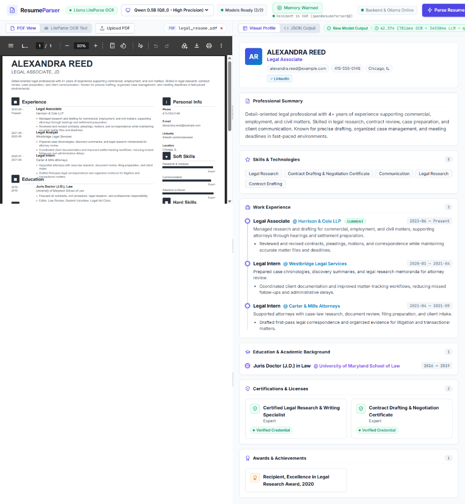

# qewnResumePraser 🚀

A high-performance, edge-to-edge AI Resume & CV Parser powered by **FastAPI (Python)**, **Llama LiteParse OCR Engine**, and **Local Ollama** running dedicated Qwen 0.5B quantized GGUF models.

**Why this project?** 
This project utilizes a **Qwen2.5 0.5B model that I have custom fine-tuned** specifically for resume parsing. By leveraging a Small Language Model (SLM), `qewnResumePraser` allows you to perform fast, highly accurate data extraction entirely locally on your own hardware. This eliminates the need to rely on costly, high-latency API calls to larger cloud models, ensuring complete data privacy and offline capabilities while maintaining excellent extraction quality.

> 💡 **Deployment Note**: For quick local testing and development, the current setup uses **Ollama**. However, for a production environment, it is highly recommended to serve the model using **vLLM** for maximum throughput and performance.

---

## 🖼️ Sample Result & UI Preview



---

## ✨ Key Features

- 📄 **Llama LiteParse OCR**: High-speed, spatial layout-aware OCR engine that accurately preserves multi-column layouts, tables, and sections.
- ⚡ **Local Quantized Qwen Models**:
  - `qwenResumeParserQ8` (8-bit Q8_0 High Precision for maximum extraction accuracy).
  - `qewnResumePraser` (4-bit Q4_K_M Fast for high throughput).
- 🧠 **RAM Resident Keep-Alive**: Models stay memory-locked (`keep_alive: -1`, `num_ctx: 4096`) for rapid, low-latency subsequent inference.
- 🔍 **Backend Post-Processing**: Filters hallucinated languages, cleans empty experience slots, and repairs LLM JSON syntax.
- 🖥️ **Interactive Full-Screen Web UI**: Resizable split-pane viewer (PDF 90% zoom preview on left, formatted visual profile + raw/cleaned JSON on right).
- 📋 **Interactive Model Verification & Setup Guide**: Automatic check and 1-click registration commands.

## 📊 JSON Extraction Schema

The SLM guarantees output in the following structured JSON format:

```json
{
  "full_name": "string|null",
  "email": "string|null",
  "phone": "string|null",
  "location": {
    "city": "string|null",
    "state": "string|null",
    "country": "string|null"
  },
  "links": ["string"],
  "summary": "string|null",
  "skills": ["string"],
  "experience": [
    {
      "company": "string|null",
      "title": "string|null",
      "location": "string|null",
      "start_date": "string|null",
      "end_date": "string|null",
      "description": "string|null"
    }
  ],
  "education": [
    {
      "institution": "string|null",
      "degree": "string|null",
      "start_date": "string|null",
      "end_date": "string|null"
    }
  ],
  "certifications": [
    {
      "name": "string|null",
      "issuer": "string|null",
      "date": "string|null"
    }
  ],
  "awards_achievements": [
    {
      "name": "string|null",
      "issuer": "string|null",
      "date": "string|null",
      "description": "string|null"
    }
  ],
  "projects": [
    {
      "name": "string|null",
      "description": "string|null",
      "url": "string|null",
      "technologies": ["string"]
    }
  ],
  "spoken_languages": ["string"]
}
```

---

## 🛠️ Tech Stack

- **Backend**: Python 3.10+, FastAPI, Uvicorn, LiteParse, HTTPX, Pydantic v2
- **OCR Engine**: Llama LiteParse (`liteparse`)
- **LLM Engine**: Ollama (`http://localhost:11434`)
- **Frontend**: Vanilla JavaScript, CSS3 Design System, HTML5 (Served via FastAPI StaticFiles)

---

## 🚀 Quick Start

### 1. Clone & Install Dependencies

```bash
# Install Python dependencies
pip install -r requirements.txt
```

### 2. Download Models & Register in Local Ollama

The model weights and Modelfiles are hosted on Hugging Face.

```bash
# 1. Download the models from Hugging Face
git clone https://huggingface.co/thrinath25/qwen2.5-0.5b-resume-parser
cd qwen2.5-0.5b-resume-parser

# 2. Register Q8_0 High Precision Model
ollama create qwenResumeParserQ8 -f ./Modelfile.q8_0

# 3. Register Q4_K_M Fast Model
ollama create qewnResumePraser -f ./Modelfile.q4_k_m

# 4. Verify in Ollama
ollama list
```

### 3. Run the FastAPI Server

```bash
# Run with uvicorn (port 3000)
uvicorn main:app --host 0.0.0.0 --port 3000 --reload
```

Open **http://localhost:3000** in your browser.
Interactive API documentation is available at **http://localhost:3000/docs**.

---

## 📡 API Endpoints

| Method | Endpoint | Description |
| :--- | :--- | :--- |
| `GET` | `/api/status` | System health, LiteParse readiness, and Ollama keep-alive status. |
| `GET` | `/api/models/check` | Real-time verification of Qwen resume parser models in Ollama. |
| `POST` | `/api/preload` | Pre-warms and locks the chosen model in RAM with `keep_alive: -1`. |
| `POST` | `/api/parse-pdf` | Uploads PDF resume, extracts layout text with LiteParse, and parses via Ollama. |
| `POST` | `/api/parse-text` | Directly parses raw resume text string into structured JSON. |

---

## 📂 Project Structure

```
.
├── assets/                  # Documentation & UI preview assets
│   └── sample_result.png    # Sample parsing UI preview
├── main.py                  # FastAPI Application & Endpoints
├── requirements.txt         # Python Dependencies
├── Modelfile.q8_0           # Ollama Modelfile for Q8_0 model
├── Modelfile.q4_k_m         # Ollama Modelfile for Q4_K_M model
├── quantized_gguf_models.zip # GGUF weights & Modelfiles archive
├── public/                  # Frontend SPA
│   ├── index.html           # Full-screen workspace UI
│   ├── app.js               # Client application logic
│   └── style.css            # Modern UI styling & themes
├── .gitignore               # Git ignore rules
└── README.md                # Project documentation
```

---

## 🔒 License

MIT License.
